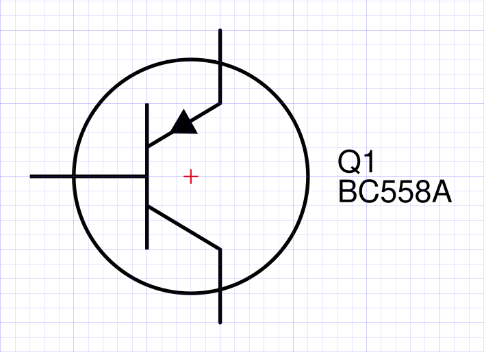

# Electrical Template Symbol Library

<figure>                                                                                                                                                                                                                                                                                                                                                                              
  
</figure>

Electrical Templates is a symbol library used to make good-looking and uniformized electrical circuit schematics in a vectorized software. The original source is from Inkscape and all sources are developed in Inkscape SVG format which should be natively supported by most vector editors like Illustrator, CorelDRAW *et cetera*.

## Development conventions

The symbols are drawn in a milimmeter grid and all points should follow the grid; this ensures scalability and reproductibility.

In order to keep the grid fixed, the page size is set to A4 size and **should not be changed**, as doing so will move the grid and mess with the formatting of the symbols.

## How to use

If you want to add a component to your drawing, simply copy the drawing from the source file and paste into your circuit file or import the source file SVG. Avoid modifying the source drawings.
