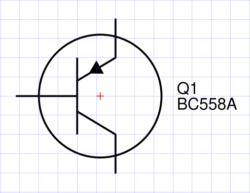
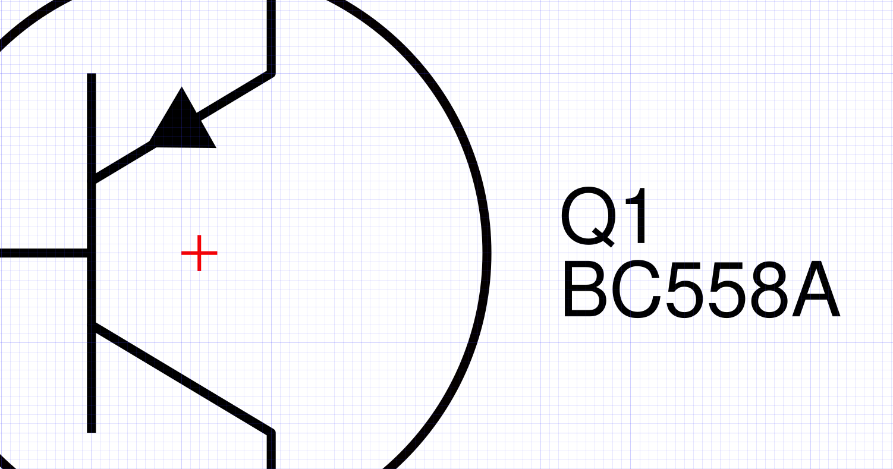

# Electrical Template Symbol Library

<figure>                                                                                                                                                                                                                                                                                                                                                                              
  
</figure>

Electrical Templates is a symbol library used to make good-looking and uniformized electrical circuit schematics in a vectorized software. The original source is from Inkscape and all sources are developed in Inkscape SVG format which should be natively supported by most vector editors like Illustrator, CorelDRAW *et cetera*.

## Standards

This symbol library follows the [IEEE/ANSI standard 315-1975](https://standards.ieee.org/standard/315-1975.html) for its references as to how to draw the symbols.

Since the standard does not indicate grid or sizes, some liberties were taken to better reflect the symbols in the standard to digital form.

## Development conventions

In order to ensure scalability and reproductibility, certain aspects are enforced and uniformized throughout the symbols:

- Points use a 1mm grid with thicker lines at every 1cm. All points should snap to the grid. It is recommended to use grid-snapping;
- In order for the images to be compatible throughout all systems, the font used is *sans-serif* which is an open-source adaptation of Helvetica;
- Line thickess was kept as 1mm throughout symbols;
- All documents have four layers:
	- **Values** for values (in the case of passives, their nominal values like 10k Ohm or 100nF)
	- **Designators** for the designators (R1, C3, U3 etc)
	- **Anchors** for graphics anchors such as circle centers
	- **Drawings** for the drawings themselves

In order to keep the grid fixed, the page size is set to A4 size and **should not be changed**, as doing so will move the grid and mess with the formatting of the symbols.

## How to use

If you want to add a component to your drawing, simply copy the drawing from the source file and paste into your circuit file or import the source file SVG. Avoid modifying the source drawings.

### How to deal with the layers

The layers are an important aspect of the symbols because they allow the user to hide and show important pieces of information. It is recommended that all objects in all layers be copied over to the final circuit; one can hide or un-hide certain layers to keep unwanted objects out of the final drawing.

### About anchors

Since these symbols are graphic tools first and foremost, there needs to be some graphical convention as to what is a symbol "center", so that the concepts of alignment and linkage can be understood. The anchors (red crosses in 0.5mm traces) are just that, conventions to what are the symbols "centers" as graphical reference points. It is highly recommended to keep the anchors fixed in their position relative to their symbols.

In most symbols the anchors are conveniently placed in notable points like geometrical centers. Nevertheless, all anchors are snapped to the 1mm grid and should be kept like that.

## Licensing

This library is licensed under a slight modified BSD "three clause" license, which means it is free to use even commercially (credits are appreciated, however), but redistributions must follow the copyleft principle.
